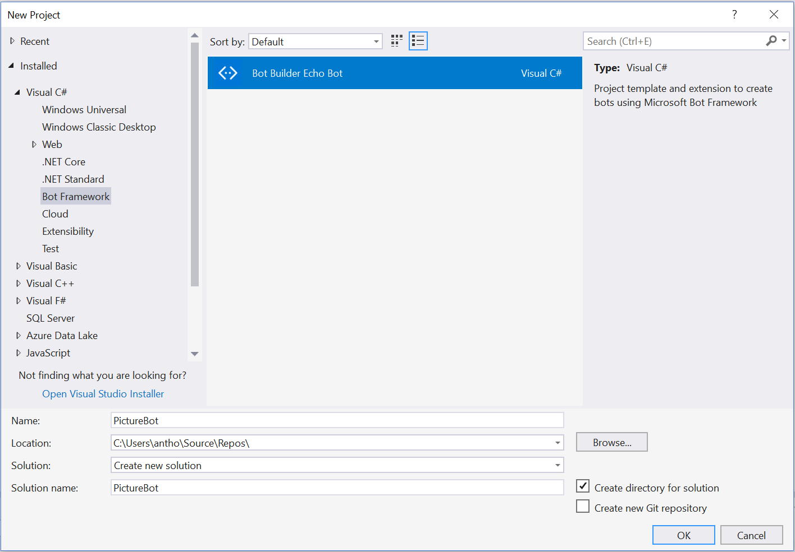

## 1_Dialogs_and_Regex:
Estimated Time: 45-60 minutes

## Building a Bot

We assume that you've had some exposure to the Bot Framework. If you have, great. If not, don't worry too much, you'll learn a lot in this section. We recommend completing [this tutorial](https://docs.microsoft.com/en-us/azure/bot-service/dotnet/bot-builder-dotnet-sdk-quickstart?view=azure-bot-service-4.0) and checking out the [documentation](https://docs.microsoft.com/en-us/bot-framework/).

### Lab 1.1: Setting up for bot development

We will be developing a bot using the latest .NET SDK (v4).  To get started, we'll need to download the Bot Framework Emulator, and we'll need to clone and build the SDK. We'll emulate everything locally in this lab, and won't need any keys or services at this point.  

#### Download the Bot Framework Emulator  

You can download the v4 Preview Bot Framework Emulator for testing your bot locally. The instructions for the rest of the labs will assume you've downloaded the v4 Emulator (as opposed to the v3 Emulator). Download the emulator by going to [this page](https://github.com/Microsoft/BotFramework-Emulator/releases) and download the most recent version of the emulator (select the ".exe" file, if you are using windows).  

The emulator installs to `c:\Users\`_your-username_`\AppData\Local\botframework\app-4.0.15\botframework-emulator.exe` or to your Downloads folder, depending on browser.  

#### Download the Bot Builder Template  

Download the [Bot Builder SDK v4 Template for C# here](https://marketplace.visualstudio.com/items?itemName=BotBuilder.botbuilderv4) and click "Save as" to save it to your Visual Studio ItemTemplates folder  for Visual C#. This is typically located in `C:\Users\`_your-username_`\Documents\Visual Studio 2017\Templates\ItemTemplates\Visual C#`. Navigate to the folder location and double-click on the install and click "Install" to add the template to your Visual Studio templates. Depending on your browser, when you download the template, you can double-click on it and install it directly to Visual Studio Community 2017; that is fine.

### Lab 1.2: Creating a simple bot and running it

Open Visual Studio, and create a new project (select **File > New > Project**) and title it "PictureBot".  Make sure to select the "Bot Builder Echo Bot" template and extension.

  

Select **OK**. You'll now see a template for a simple Echo Bot that can echo users' messages and keep track of turns (how many messages have been sent between user and bot).

>**TIP**:  If you only have one monitor and you would like to easily switch between instructions and Visual Studio, you can add the instruction files to your Visual Studio solution by right-clicking on the project in Solution Explorer and selecting **Add > Existing Item**. Navigate to "lab02.2-bulding_bots," and add all the files of type "MD File." 

Right-click on the solution in Solution Explorer and select "Manage NuGet Packages for Solution." Install all of the packages listed below (you may already have some of these and that is fine, you shouldn't need to reinstall or update them).  Make sure you check the box "Include prerelease" and are on the "Browse" tab. After you've installed them, under **Dependencies > NuGet** in your Solution Explorer, you should see the following packages:  
 
* Microsoft.AspNetCore.All
* Microsoft.Bot.Builder.Integration.AspNet.Core
* Microsoft.Bot.Builder.Core
* Microsoft.Bot.Builder.Dialogs  
* Microsoft.Bot.Builder.Core.Extensions
* Microsoft.Bot.Builder.AI.LUIS  
* Microsoft.Azure.Search  

We need to add some code to tell the app what to show us in the browser when we run it. Navigate to the html file called `default.htm` under the wwwroot folder, and replace the default contents with the following:
```html
<!DOCTYPE html>
<html>
<head>
    <title></title>
    <meta charset="utf-8" />
</head>
<body style="font-family:'Segoe UI'">
    <h1>PictureBot</h1>
    <p>Describe your bot here and your terms of use etc.</p>
    </body>
</html>
```  

Next, review the Startup.cs file. There are many comments within to help you understand what is happening. Spend a few minutes reading through.

Update the list of `using` statements to the following:   
```csharp
using System;
using Microsoft.AspNetCore.Builder;
using Microsoft.AspNetCore.Hosting;
using Microsoft.Bot.Builder.BotFramework;
using Microsoft.Bot.Builder.Core.Extensions;
using Microsoft.Bot.Builder.Integration.AspNet.Core;
using Microsoft.Extensions.Configuration;
using Microsoft.Extensions.DependencyInjection;
using System.Text.RegularExpressions;
using Microsoft.Bot.Builder.Ai.LUIS;
```

Replace the ConfigureServices method with the following:  
```csharp
// This method gets called by the runtime. Use this method to add services to the container.
        public void ConfigureServices(IServiceCollection services)
        {
            services.AddBot<PictureBot>(options =>
            {
                options.CredentialProvider = new ConfigurationCredentialProvider(Configuration);
                var middleware = options.Middleware;

                // The Memory Storage used here is for local bot debugging only. When the bot
                // is restarted, anything stored in memory will be gone. 
                IStorage dataStore = new MemoryStorage();

                // Add middleware below
                middleware.Add(new UserState<UserData>(dataStore));
                middleware.Add(new ConversationState<ConversationInfo>(dataStore));
                // Add Regex ability below


                // Add LUIS ability below

            });
        }
```

You should see an error (red squiggly) beneath "PictureBot", "UserData", and "ConversationInfo", because we haven't created those yet. This is where we'll store the context of the conversation with our users. Remember, we're only using local memory for testing purposes. For production, you'll have to implement a way to [manage state data](https://docs.microsoft.com/en-us/azure/bot-service/bot-builder-storage-concept?view=azure-bot-service-4.0).  


Delete the EchoBot.cs and EchoState.cs files. If you want to explore the EchoBot further, you can follow [this tutorial](https://docs.microsoft.com/en-us/azure/bot-service/dotnet/bot-builder-dotnet-sdk-quickstart?view=azure-bot-service-4.0) **later**.  

Create a PictureState.cs class file. Update the file to this:
```csharp
using System.Collections.Generic;

namespace PictureBot
{
    /// <summary>
    /// Class for storing conversation data. 
    /// </summary>
    public class ConversationInfo : Dictionary<string, object> { }

    /// <summary>
    /// Class for storing user data in the conversation. 
    /// </summary>
    public class UserData
    {

        public string Greeted { get; set; } = "not greeted";

    }
}
```

Save the file. This is where we'll store information about the active conversation. You can see we're also keeping track of whether we've greeted the user, so we don't do it more than once. This should address our error in Startup.cs. Confirm this.  

Create a PictureBot.cs class file. Update the file to this:  
```csharp
using System.Threading.Tasks;
using Microsoft.Bot.Builder;
using Microsoft.Bot.Schema;
using Microsoft.Bot;

namespace PictureBot
{
    public class PictureBot : IBot
    {
        public async Task OnTurn(ITurnContext context)
        {
            if (context.Activity.Type is ActivityTypes.Message)
            {
                await context.SendActivity($"Hello world.");
            }

        }
    }
}
```


Now start your bot (with or without debugging) by pressing the "IIS Express" button that looks like a play button (or hit F5). NuGet should take care of downloading the appropriate dependencies.  
* Your default.htm page will be displayed in a browser.
* Note the localhost port number for the page. You will need this information to interact with your bot.  

Get stuck? You can find the solution for the lab up until this point under [resources/code/FinishedPictureBot-Part0](./resources/code/FinishedPictureBot-Part0).

#### Using the Bot Framework Emulator  
To interact with your bot:
* Launch the Bot Framework Emulator (note we are using the v4 PREVIEW Emulator).  (If you just installed it, it may not be indexed to show up in a search on your local machine, so remember that it installs to `C:\Users\`your-username`\AppData\Local\botframework\app-`_version_`\botframework-emulator.exe`.)  
* Select "Open bot" on the Welcome page and navigate to the "PictureBot.bot" file in the root of your project (probably something similar to `C:\Users\`your-username`\Source\Repos\PictureBot\PictureBot\PictureBot`).
* Now, you should be able to click the message tab (on the left menu) and the PictureBot listed under "ENDPOINT."
* You should now be able to converse with the bot. 
* Type "hello", and the bot will respond with "Hello World" to every message.

 

You can read more about using the Emulator [here](https://docs.microsoft.com/en-us/azure/bot-service/bot-service-debug-emulator?view=azure-bot-service-4.0).  
> Fun Aside: why this port number?  It is set in your project properties.  In your Solution Explorer, double-click **Properties>Debug** and examine its contents. Does the App URL match what you connected to in the emulator?

Browse around and examine the sample bot code. In particular, note:
+ **Startup.cs** is where we will add services/middleware and configure the HTTP request pipeline.  
+ In **PictureBot.cs**, `OnTurn` is the entry point which waits for a message from the user, and `context.Activity.Type is ActivityTypes.Message` is where we can react to a message once received and wait for further messages.  We can use `context.SendActivity` to send a message from the bot back to the user.  


### Lab 1.3: Organizing Code for Bots

There are many different methods and preferences for developing bots. The SDK allows you to organize your code in whatever way you want. In these labs, we'll organize our conversations into different dialogs, and we'll explore a [MVVM style](https://msdn.microsoft.com/en-us/library/hh848246.aspx) of organizing code around conversations.

This PictureBot will be organized in the following way:
* **Dialogs** - the business logic for editing the models
* **Responses** - classes which define the outputs to the users  
* **Models** - the objects to be modified

Next, create a folder for each piece in your PictureBot project (create three folders: "**Dialogs**", "**Responses**", "**Models**").  

#### Dialogs  

If you developed bots with the Bot Framework SDK (v3), then you're probably familiar with Dialogs and how they work. If you aren't, read [this page on Dialogs](https://docs.microsoft.com/en-us/azure/bot-service/bot-builder-dialog-manage-conversation-flow?view=azure-bot-service-4.0&tabs=csharp) before continuing.  

When a bot has the ability to perform multiple tasks, it is nice to be able to have multiple dialogs, or a set of dialogs, to help users navigate through different conversation flows. For our PictureBot, we want our users to be able to go through our menu flow, often referred to as a root dialog, and then branch off to different dialogs depending what they are trying to do - search pictures, share pictures, order pictures, or get help. We can do this easily by using a dialog container. Read about [creating modular bot logic with dialog containers](https://docs.microsoft.com/en-us/azure/bot-service/bot-builder-compositcontrol?view=azure-bot-service-4.0&tabs=csharp) before continuing.  


For the purposes of this lab, we are going to keep things simple, but after, you should be able to create a dialog container with many dialogs. For our PictureBot, we'll have two main dialogs:  

* **RootDialog** - The default dialog the bot starts out with. This dialog will start other dialog(s) as the user requests them. This dialog, as it is the main dialog for the dialog set, will be responsible for creating the container and redirecting users to other dialogs as needed.
* **SearchDialog** - A dialog which manages processing search requests and returning those results to the user.  

Create a class, called "SearchDialog.cs" within the "Dialogs" folder. Replace the contents with the following shell:  
```csharp
using System.Linq;
using System.Threading.Tasks;
using Microsoft.Azure.Search;
using Microsoft.Azure.Search.Models;
using Microsoft.Bot.Builder.Dialogs;
using PictureBot.Responses;
using PictureBot.Models;
using Microsoft.Bot.Builder;
using Microsoft.Bot.Schema;

namespace PictureBot.Dialogs
{
    public class SearchDialog : DialogContainer
    {
        public const string Id = "searchPictures";

        public static SearchDialog Instance { get; } = new SearchDialog();

        // You can start this from the parent using the dialog's ID.
        public SearchDialog() : base(Id)
        {
            // add search dialog contents here
        }
        // process search below
    }
}
```
In the shell above, we've labeled the dialog, and we've initiated a new instance of it. We'll call this from RootDialog.  

> Note: Are you getting an error around `using PictureBot.Responses;` and `using PictureBot.Models;`? Make sure you've created folders for Responses and Models (see instructions just before the **Dialogs** section begins). If you still receive the error, that's fine, we'll address it in the next sections.  

Let's back up and create our RootDialog. Because it is the main dialog for the dialog container, we'll create it right within PictureBot.cs.  

Navigate back to PictureBot.cs and replace the contents with the following:
```csharp
using System.Threading.Tasks;
using Microsoft.Bot;
using Microsoft.Bot.Builder;
using Microsoft.Bot.Builder.Core.Extensions;
using Microsoft.Bot.Schema;
using Microsoft.Bot.Builder.Dialogs;
using PictureBot.Models;
using PictureBot.Responses;
using PictureBot.Dialogs;
using System.Linq;
using Microsoft.Bot.Builder.Ai.LUIS;
using Newtonsoft.Json;
using Newtonsoft.Json.Linq;
using Microsoft.Azure.Search;
using Microsoft.Azure.Search.Models;

namespace PictureBot
{
    public class PictureBot : IBot
    {
        private const string RootDialog = "rootDialog";
        private DialogSet _dialogs { get; } = ComposeMainDialog();

        /// <summary>
        /// Every Conversation turn for our bot calls this method. 
        /// </summary>
        /// <param name="context">The current turn context.</param>        
        public async Task OnTurn(ITurnContext context)
        {

            if (context.Activity.Type is ActivityTypes.Message)
            {
                // Get the user and conversation state from the turn context.
                var state = UserState<UserData>.Get(context);
                var conversationInfo = ConversationState<ConversationInfo>.Get(context);

                // Establish dialog state from the conversation state.
                var dc = _dialogs.CreateContext(context, conversationInfo);

                // Continue any current dialog.
                await dc.Continue();
                // Every turn sends a response, so if no response was sent,
                // then there no dialog is currently active.
                if (!context.Responded)
                {
                    // Greet them if we haven't already
                    if (state.Greeted == "not greeted")
                    {
                        await RootResponses.ReplyWithGreeting(context);
                        await RootResponses.ReplyWithHelp(context);
                        state.Greeted = "greeted";
                    }
                    else
                    {
                        await dc.Begin(RootDialog);
                    }
                }
            }
        }

        /// <summary>
        /// Composes a main dialog for our bot.
        /// </summary>
        /// <returns>A new main dialog.</returns>
        private static DialogSet ComposeMainDialog()
        {
            var dialogs = new DialogSet();

            dialogs.Add(RootDialog, new WaterfallStep[]
            {
                // Duplicate the following row if your dialog will have 
                // multiple turns. In this case, we just have one
                async (dc, args, next) => { /* // add dialog for the turn here */ }
            });
            
            // Add our child dialogs (in this case just one)
            dialogs.Add(SearchDialog.Id, SearchDialog.Instance);

            return dialogs;
        }

    }
}
```

Note how we've changed the `public async Task OnTurn(ITurnContext context)`. When a user sends a message, we'll get the state, determine where the user is in the conversation, and greet them if we haven't greeted them yet. If we have greeted them, and we aren't in the middle of a dialog, we'll start a new RootDialog.  

Using what we learned from [reading about creating modular bot logic with dialog containers](https://docs.microsoft.com/en-us/azure/bot-service/bot-builder-compositcontrol?view=azure-bot-service-4.0&tabs=csharp), we created the shell for `private static DialogSet ComposeMainDialog()`.  

Review the code in PictureBot.cs to confirm you understand what we're doing so far. We'll add some more to this in a bit.  

#### Responses
Create two classes, called "RootResponses.cs" and "SearchResponses.cs" within the "Responses" folder. As you may have figured out, the Responses files will simply contain the different outputs we may want to send to users, no logic.  

Within "RootResponses.cs" add the following:
```csharp
using System.Threading.Tasks;
using Microsoft.Bot.Builder;

namespace PictureBot.Responses
{
    public class RootResponses
    {
        public static async Task ReplyWithGreeting(ITurnContext context)
        {
            // Add a greeting
        }
        public static async Task ReplyWithHelp(ITurnContext context)
        {
            await context.SendActivity($"I can search for pictures, share pictures and order prints of pictures.");
        }
        public static async Task ReplyWithResumeTopic(ITurnContext context)
        {
            await context.SendActivity($"What can I do for you?");
        }
        public static async Task ReplyWithConfused(ITurnContext context)
        {
            // Add a response for the user if Regex or LUIS doesn't know
            // What the user is trying to communicate
        }
        public static async Task ReplyWithLuisScore(ITurnContext context, string key, double score)
        {
            await context.SendActivity($"Intent: {key} ({score}).");
        }
        public static async Task ReplyWithShareConfirmation(ITurnContext context)
        {
            await context.SendActivity($"Posting your picture(s) on twitter...");
        }
        public static async Task ReplyWithOrderConfirmation(ITurnContext context)
        {
            await context.SendActivity($"Ordering standard prints of your picture(s)...");
        }
    }
}
```

Note that there are two responses with no values (ReplyWithGreeting and ReplyWithConfused). Fill these in as you see fit.

Within "SearchResponses.cs" add the following:
```csharp
using Microsoft.Bot.Builder;
using System;
using System.Collections.Generic;
using System.Linq;
using System.Threading.Tasks;

namespace PictureBot.Responses
{
    public class SearchResponses
    {
        // add a task called "ReplyWithSearchRequest"
        // it should take in the context and ask the
        // user what they want to search for


        public static async Task ReplyWithSearchConfirmation(ITurnContext context, string utterance)
        {
            await context.SendActivity($"Ok, searching for pictures of {utterance}");
        }
        public static async Task ReplyWithNoResults(ITurnContext context, string utterance)
        {
            await context.SendActivity("There were no results found for \"" + utterance + "\".");
        }
    }
}
```

Note here a whole task is missing. Fill in as you see fit, but make sure the new task has the name "ReplyWithSearchRequest", or you may have issues later.  

#### Models 
Due to time limitations, we will not be walking through creating all the models. They are straightforward, and we recommend taking some time to review the code within after you've added them. Right-click on the "Models" folder and select **Add>Existing Item**. Navigate to "lab02.2-building_bots/resources/code/Models" (making sure you're in the SDK v4 directory!), select all three files, and select "Add."  

At this point, your Solution Explorer should look similar to the following image:

 

Are you missing anything? Now's a good time to check.


### Lab 1.4: Regex and Middleware

There are a number of things that we can do to improve our bot.  First of all, we may not want to call LUIS for a simple "hi" greeting, which the bot will get fairly frequently from its users.  A simple regular expression could match this, and save us time (due to network latency) and money (due to cost of calling the LUIS service).  

Also, as the complexity of our bot grows, and we are taking the user's input and using multiple services to interpret it, we need a process to manage that flow.  For example, try regular expressions first, and if that doesn't match, call LUIS, and then perhaps we also drop down to try other services like [QnA Maker](http://qnamaker.ai) and Azure Search. A great way to manage this is through [Middleware](https://docs.microsoft.com/en-us/azure/bot-service/bot-builder-concept-middleware?view=azure-bot-service-4.0), and the SDK does a great job supporting that. We call middleware from `ConfigureServices` under `Startup.cs`, simply by calling additional options add it (check your `Startup.cs` file to see the location). 

Before continuing with the lab, learn more about middleware and the Bot Framework SDK:  
1.  [Overview and Architecture](https://docs.microsoft.com/en-us/azure/bot-service/bot-builder-basics?view=azure-bot-service-4.0)
2.  [Middleware](https://docs.microsoft.com/en-us/azure/bot-service/bot-builder-concept-middleware?view=azure-bot-service-4.0)
2.  [Creating Middleware](https://docs.microsoft.com/en-us/azure/bot-service/bot-builder-create-middleware?view=azure-bot-service-4.0&tabs=csaddmiddleware%2Ccsetagoverwrite%2Ccsmiddlewareshortcircuit%2Ccsfallback%2Ccsactivityhandler)  

Ultimately, we'll use some middleware to try to understand what users are saying with regular expressions (Regex) first, and if we can't, we'll call LUIS. If we still can't, then we'll drop down to a generic "I'm not sure what you mean" response, or whatever you put for "ReplyWithConfused."    

To add the middleware for Regex to your solution, create a new folder called "Middleware," and add the contents of the "Middleware" folder (you can find this under **resources > code**) to your solution. You can also use this middleware in your future projects.

In "Startup.cs", below the "Add Regex ability below" comment within `ConfigureServices`, add the following:
```csharp
                middleware.Add(new RegExpRecognizerMiddleware()
                .AddIntent("search", new Regex("search picture(?:s)*(.*)|search pic(?:s)*(.*)", RegexOptions.IgnoreCase))
                .AddIntent("share", new Regex("share picture(?:s)*(.*)|share pic(?:s)*(.*)", RegexOptions.IgnoreCase))
                .AddIntent("order", new Regex("order picture(?:s)*(.*)|order print(?:s)*(.*)|order pic(?:s)*(.*)", RegexOptions.IgnoreCase))
                .AddIntent("help", new Regex("help(.*)", RegexOptions.IgnoreCase)));

```

> We're really just skimming the surface of using regular expressions. If you're interested, you can [learn more here](https://docs.microsoft.com/en-us/dotnet/standard/base-types/regular-expression-language-quick-reference).  

Hopefully, it's fairly easy to see what we're doing here. Because of the order, we'll try Regex then LUIS. Without adding LUIS, our bot is really only going to pick up on a few variations, but it should capture a lot, if the users are using the bot for searching and sharing and ordering pictures. 

> Fun Aside: One might argue that the user shouldn't have to type "help" to get a menu of clear options on what the bot can do; rather, this should be the default experience on first contact with the bot.  **Discoverability** is one of the biggest challenges for bots - letting the users know what the bot is capable of doing.  Good [bot design principles](https://docs.microsoft.com/en-us/bot-framework/bot-design-principles) can help.   

#### RootDialog, Again

Let's get down to business. We need to fill out RootDialog within PictureBot.cs so that our bot can react to what users say they want to do.  

Based on our results from Regex, we need to direct the conversation in the right direction. Read the code carefully to confirm you understand what it's doing, then paste in the following code to replace the line `async (dc, args, next) => { /* // add dialog for the turn here */ }`:
```csharp
                async (dc, args, next) =>
                {
                    // Get the state of the conversation 
                    var conversation = ConversationState<ConversationInfo>.Get(dc.Context);
                    // If Regex picks up on anything, store it
                    var recognizedIntents = dc.Context.Services.Get<IRecognizedIntents>();
                    // Based on the recognized intent, direct the conversation
                    switch (recognizedIntents.TopIntent?.Name)
                    {
                            case "search":
                                // switch to SearchDialog
                                await dc.Begin(SearchDialog.Id);
                                break;
                            case "share":
                                // respond that you're sharing the photo
                                await RootResponses.ReplyWithShareConfirmation(dc.Context);
                                break;
                            case "order":
                                // respond that you're ordering
                                await RootResponses.ReplyWithOrderConfirmation(dc.Context);
                                break;
                            case "help":
                                // show help
                                await RootResponses.ReplyWithHelp(dc.Context);
                                break;
                        default:
                            // respond that you don't understand
                            await RootResponses.ReplyWithConfused(dc.Context);
                            break;
                    }
                }
```


Hit F5 to run the bot. Test it by sending commands like "help", "share pics", "order pics", and "search pics". If the only thing that failed was "search pics", everything is working how you configured it. But why is "search pics" failing? Have an answer before you move on!

Get stuck? You can find the solution for this lab under [resources/code/FinishedPictureBot-Part1](./resources/code/FinishedPictureBot-Part1).


### Continue to [2_Azure_Search](./2_Azure_Search.md)  
Back to [README](./0_README.md)
