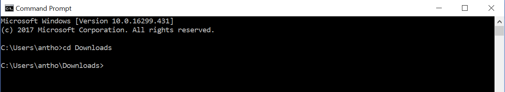
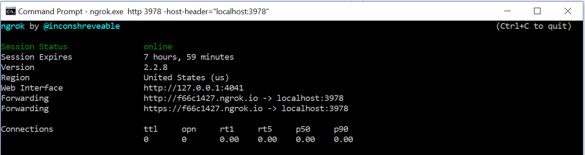
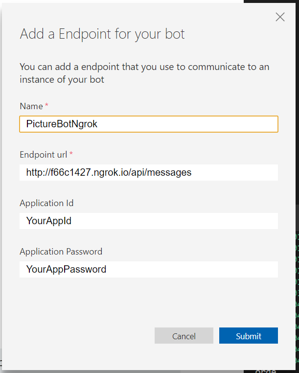
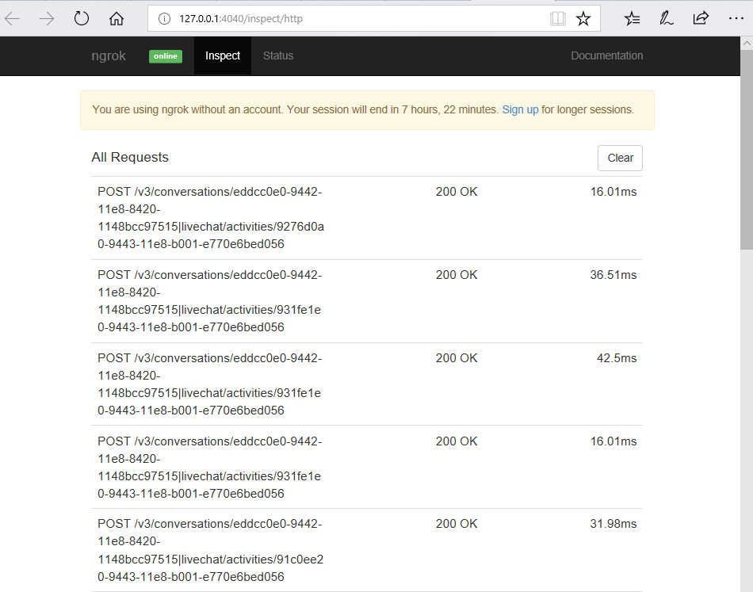

## 1_Ngrok:
Estimated Time: 10-15 minutes

## Connecting to bots hosted remotely with ngrok

With Microsoft Bot Framework, to configure the bot to be available to a particular channel, you will need to host the Bot service on a public URL endpoint. The channel will not be able to access your bot service if it is on a local server port hidden behind a NAT or firewall.  

When designing/building/testing your code, you do not always want to have to keep redeploying. This will result in additional hosting costs. This is where ngrok can really help in speeding up the development/testing phases of bots. The goal of this lab is to use ngrok to expose your bot to the public internet and use the public endpoints to test your bots in the emulator.

### Lab 1.1: Setup  

There are a few things we need to configure before we get started:

1. Download ngrok from this website: https://ngrok.com/download. Click "Save as" when you download it so you can control where it gets saved (pick your Documents or Downloads folder, it should default to Downloads). Next, navigate to the install location and unzip the file (right click and select "Extract all...") and extract it one level up from the downloaded file (e.g. to  C:\Users\antho\Downloads\).  
2. Open the Bot Framework Emulator and hit the settings button (gear icon in bottom left corner). In the "Path to ngrok" box, hit "Browse," find "ngrok.exe", click "Select ngrok", and then click "Save".

### Lab 1.2: Forwarding  

Open your published PictureBot.sln. Run the bot and connect to it using the emulator. In the Log, you should see something similar to the following:  


Note how it says we will bypass ngrok for local addresses. So we're not using ngrok at the moment, but we will next.  

Given that our bot is being hosted on http://localhost:3978/, we can use ngrok to expose this port to the public internet. Open the terminal (search in your start menu for "cmd"), and navigate to where ngrok is installed:



Next, run the below command:

```cmd
ngrok.exe http 3978 -host-header="localhost:3978"
```

You should see something similar to the following:


Return to the emulator. Find the "Endpoint" tab on the left, you should see one for PictureBot. Select to "+" icon next to "Endpoint" to create a new endpoint connection. Name it "PictureBotNgrok" and enter your forwarding (http) url (appending "/api.messages", as well as your AppId and AppPassword. Click "Submit."



Send some sample messages to the bot. Now, you should be able to monitor the calls in two places: the terminal (which you should already have open) and at the ngrok traffic inspector link (provided in the emulator in the Log area).  




So now, if you're using Windows and running your bot behind a firewall or other network boundary, you're able to connect to a bot that is hosted remotely. While this is a good exercise to understand what's happening underneath, recent updates to the Bot Framework emulator have made it tightly integrated with ngrok, lauching it automatically (in **most** cases) when it is needed. 

### Continue to [2_Direct_Line](./2_Direct_Line.md)
Back to [README](./0_README.md)
