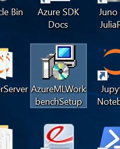
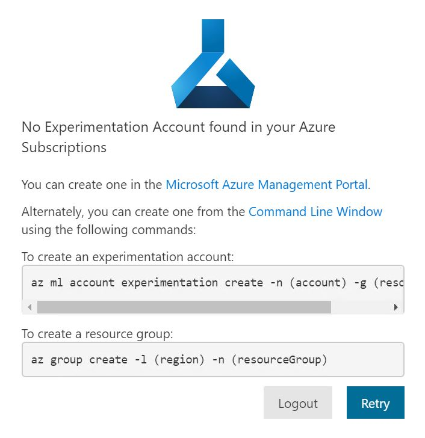
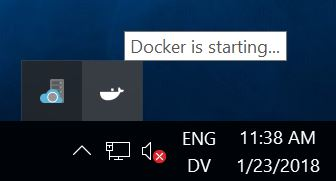
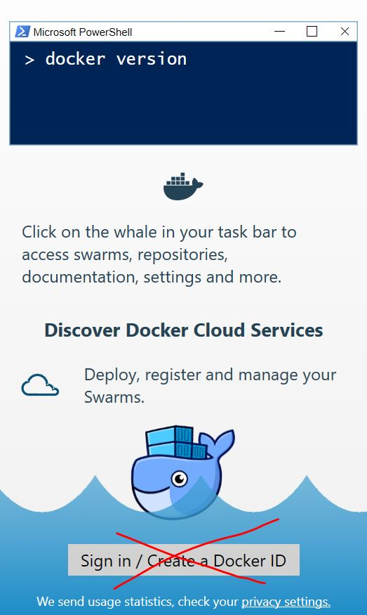
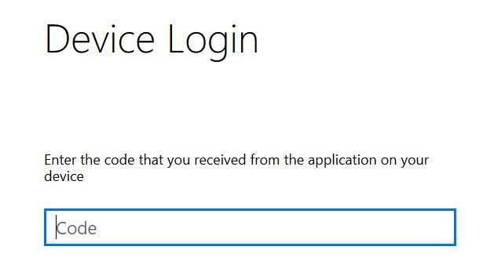

# Setting up for the bootcamp

The following steps will get us up and running for the bootcamp. These activities take about 2.5 hours in total and should be completed **prior to attending** the bootcamp. Failure to do so will result in falling behind during the workshop and divert time and attention from the material covered throughout the bootcamp.
 
## What we will need for this workshop: 

 -  A Microsoft Azure account where we can create resources, including Application Insights. This could be an organization account, an MSDN subscription account, a Trial Account, or a work account.
 -  A Windows laptop on which we can install software **OR** any machine with **Remote Desktop Connection** so that we can access a remote Windows Data Science Virtual Machine (DSVM) (Note: a **v3** type VM is required to leverage Docker if we chose an Azure DSVM, and this is officially not yet supported)
 -  A Microsoft Azure Machine Learning Experimentation account and an accompanying Model Management account.

## Provisioning the environment

For this workshop, we go the link [http://bit.ly/ai-dev-04](http://bit.ly/ai-dev-04) and fill out and submit the form. This will provide us with an Azure account we can use throughout the workshop, and credentials to log into a DSVM that is provisioned for the purpose of running the labs. To log into the DSVM, we simply launch **Remote Desktop Connection** from our machines and enter the DSVM name followed by our credentials.

From the DSVM, open up a web browser. To create an Azure Machine Learning Experimentation and Model Management accounts we first log into the Azure portal at [https://portal.azure.com/](https://portal.azure.com/) using the Azure account we are given. We can click on **Resource groups** on the left to see the one resource group that was created for us. We should copy the name of this resource group and save it somewhere as we will need it throughout the lab. We now click on **+ New** to create a new resource and search for the term **machine learning** in the search bar and in the results select **Machine Learning Experimentation (preview)** and click on **Create**.

We need to fill out a form and provide some information about the account: 

- choose an account name
- select the subscription
- choose the resource group that has already been created for us (in the lab environment we are provided, we will not be able to create a new resource group)
- leave location and number of seats as is
- make sure the storage account name is valid
- notice a Workspace is automatically created for us as part of the provisioning
- notice that by default a Model Management account is created to accompany the Experimentation account, so that we don't have to provision the Model Management account separately
- choose **S1** as the pricing tier for the Model Management account

Check the box that says **Pin to dashboard** and click on **Create** to provision the resources.

## Setting up the environment 

For the remainder of this lab, we will be working exclusively on the DSVM. So log into the DSVM and then run through the steps outlined here.

On the Desktop, click on the icon called `AzureMLWorkbenchSetup` to run the Workbench installer. The installation will take about 30 minutes. 

Once the installation finishes, we are prompted to authenticate, which we do using the Azure account we are provided for this workshop. Once we authenticate, if we are presented with a window that says **No Experimentation Account found in your Azure Subscriptions**, we need to return to the previous section of this lab to create an Experimentation and a Model Management account from the Azure portal. Once the accounts are created, we can click on **Retry** to let Workbench log in under our Experimentation account.

Launch **Docker for Windows** from the start menu. This may take a few minutes as we can see from the Docker taskbar icon.

Once Docker starts, we will see the following page.

We do NOT need to sign into Docker and can ignore and close the window prompting us to do so.

From Workbench, we now go to **File > Configure Project IDE** and name the IDE `Code` with the following path `C:\Program Files\Microsoft VS Code\Code.exe`. This will allow us to open the entire project in Visual Studio Code, which is our editor of choice for this lab.

We now log into the Azure CLI using our Azure account. Return to the Workbench and go to **File > Open Command Prompt**. Check that the Azure CLI is installed on the DSVM by typing `az -h`. Now type `az login` and copy the access code. In our browser we open a **private tab** using **CTRL+SHIFT+P** then enter the URL `aka.ms/devicelogin` and when prompted, paste in the access code. We authenticate using the same Azure account we used to log into Workbench. Note that to copy something from the command prompt, we first select it and then right-click somewhere on the command prompt. To paste something into the command prompt, we simply right click on the command prompt.

Once we log in through the browser, we can return to the command prompt and enter `az account show` to see some information about our Azue account including our subscription ID and user name. This will confirm that we are logged in to the Azure CLI.

**Note:** If we have multiple Azure subscriptions, from the command prompt we enter `az account list –o table` to see available accounts. Then copy the subscription ID from the Azure account used to create an AML Workbench account and type `az account set –s <SUBSCRIPTION_ID>`, replacing `<SUBSCRIPTION_ID>` with the account ID.

## A potential issue with Docker on the Windows DSVM

During the labs, when running an experiment you may run into a strange Docker behavior where we get an error at the top about `image operating system "linux" cannot be used on this platform`.

To resolve it we click on the Docker logo on the right-hand side in the taskbar and switch Docker to use Windows containers. This will result in a new Docker error:

Now we switch Docker back to Linux containers (by going to the taskbar once more).

We then return to the command prompt and run the above command again. This will take a few minutes. When finished, we should get a message saying `Your environment is now ready`.
