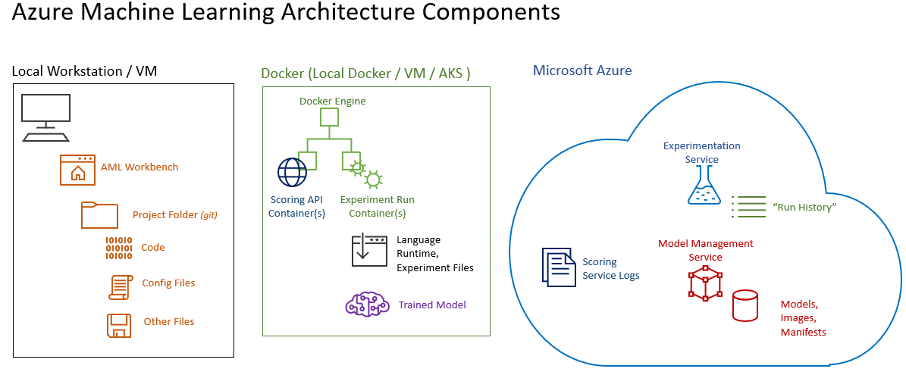

# The Team Data Science Process using Azure Machine Learning

This hands-on lab guides you through using the [Team Data Science Process](https://docs.microsoft.com/en-us/azure/machine-learning/team-data-science-process/overview) using [Azure Machine Learning Services](https://docs.microsoft.com/en-us/azure/machine-learning/preview/overview-what-is-azure-ml) with the Azure Machine Learning Workbench. We will be using a [Customer Churn Analysis example](https://docs.microsoft.com/en-us/azure/machine-learning/preview/scenario-churn-prediction) throughout this Workshp.

In this workshop, you will:
- [ ] Understand and use the TDSP to clearly define business goals and success criteria
- [ ] Understand how to use a code-repository system with the Azure Machine Learning Workbench using the TDSP structure
- [ ] Create an example environment
- [ ] Use the TDSP and AMLS for data acquisition and understanding
- [ ] Use the TDSP and AMLS for creating an experiment with a model and evaluation of models
- [ ] Use the TDSP and AMLS for deployment
- [ ] Use the TDSP and AMLS for project close-out and customer acceptance

You'll focus on the objectives above, not Data Science, Machine Learning or a difficult scenario.  

***NOTE:*** There are several pre-requisites for this course, including an understanding and implementation of: 
  *  Programming using an Agile methodology
  *  Machine Learning and Data Science
  *  Working with the Microsoft Azure Portal

There is a comprehensive Learning Path you can use to prepare for this course [located here](https://github.com/Azure/learnAnalytics-CreatingSolutionswiththeTeamDataScienceProcess-/blob/master/Instructions/Learning%20Path%20-%20Creating%20Solutions%20with%20the%20Team%20Data%20Science%20Process.md).

## Introduction and setup 

[The Primary Concepts for this lab are here](https://docs.microsoft.com/en-us/azure/machine-learning/preview/scenario-churn-prediction). We'll refer to these throughout the lab.

***NOTE*** The following steps must be completed ***prior*** to attempting this workshop:

  *  You will need a Microsoft Azure account. You can use a production Azure account if you are able to create objects. You can also use your Microsoft Developer Network (MSDN) account (if you have one) to complete this workshop. If you don't have access to a corporate or MSDN account: 
       *  Create a free account [using this process](https://azure.microsoft.com/free/)
  *  You will need an Azure Machine Learning Services account. 
       *  [Open this reference](https://docs.microsoft.com/en-us/azure/machine-learning/preview/quickstart-installation), and complete only the sections marked **"Sign in to the Azure portal"** and **"Create Azure Machine Learning accounts"**. 
       *  Write down the *Experimentation account name* and bring it to class

  *  You can use a Windows Data Science Virtual Machine (DSVM) to run this lab: 
        *  [Navigate to this path](https://azuremarketplace.microsoft.com/en-us/marketplace/apps/microsoft-ads.windows-data-science-vm), and create a Windows Azure Data Science Virtual Machine (DSVM). 
           *  Choose a VM size of: D4S_V3, with 4 virtual CPUs and 14-Gb RAM. This VM size is not available in all regions, so choose an appropriate region (`West US 2` is a good choice).
           *  When the DSVM is deployed, start it using the [Azure portal.](https://portal.azure.com)
        *  After you create and Start the DSVM, log in to it and double-click the "Install Azure Machine Learning Workbench" icon. Finish the installation by following the on-screen instructions. The installer downloads all the necessary dependent components, such as Python, Miniconda, and other related libraries. The installation might take around half an hour to finish all the components. When complete, the Azure Machine Learning Workbench is installed in the following directory: C:\\Users\\%USERNAME%\\AppData\\Local\\AmlWorkbench

  *  If you do not wish to use a Data Science Virtual Machine, you can install the Azure Machine Learning Workbench and Docker locally:
        *  [Open this reference](https://docs.microsoft.com/en-us/azure/machine-learning/preview/quickstart-installation) and follow the sections marked **Install Azure Machine Learning Workbench on Windows**
        *  You'll also need Docker for certain parts of the lab. To install it, [open this reference](https://www.docker.com/docker-windows) and follow the instructions for installing Docker locally.

## Introduction to the TDSP

## 1. Business Understanding

In the [Business Understanding](https://docs.microsoft.com/en-us/azure/machine-learning/team-data-science-process/lifecycle-business-understanding) phase of the TDSP, you discover the questions that the organization would like answered from data. This is a group effort, involving the organization, the Data Science team, and the DevOps team along with other stakeholders. 

Your scenario is as follows: 

The Orange Telecom company in France is one of the largest operators of mobile and internet services in Europe and Africa and a global leader in corporate telecommunication services. They have 256 million customers worldwide. They have significant coverage in France, Spain, Belgium, Poland, Romania, Slovakia Moldova, and a large presence Africa and the Middle East.
Customer Churn is always an issue in any company. Orange would like to predict the propensity of customers to switch provider (churn), buy new products or services (appetency), or buy upgrades or add-ons proposed to them to make the sale more profitable (up-selling). For this effort, they think churn is the first thing they would like to focus on. 

To create a solution, you will use the Azure Machine Learning Services (AMLS) and the Azure Machine Learning Services Workbench (WB) in this lab. The general configuration for working with Azure Machine Learning has these components:

### Lab: Set up a generic TDSP Structure using the Azure Machine Learning Workbench

In this lab you'll set up your project's structure, conforming to the Team Data Science Process, using the Azure Machine Learning Workbench.
- [ ] [Open this link](https://docs.microsoft.com/en-us/azure/machine-learning/preview/how-to-use-tdsp-in-azure-ml), read from the top and complete the steps there. Do not complete the steps marked **"Next Steps"**. 
- [ ] [Review this link](https://github.com/Azure/Azure-TDSP-ProjectTemplate) and verify that you have the structure shown in the directory you specified. You will use this structure throughout this workshop.

### Lab: Use-case evaluation for Data Science questions

In this lab you'll evaluate a business scenario, and detail possible predictions, classifications, or other data science questions that you can begin to explore.
- [ ] Read the scenario above carefully. You can optionally copy and paste the scenario text below into a new text file called *Business Understanding.md* in the /docs directory set up in the previous lab. After class discussion, you can enter the answers to the following questions in this document.
- [ ] Is this something that you can use a Machine Learning system for a solution?  
- [ ] Which algorithm or family of algorithms could you use to answer your question?
- [ ] What data source(s) will you need to complete your prediction? 
- [ ] How will the users interact with the solution?

## 2. Data Acquisition and Understanding

The [Data Aquisition and Understanding](https://docs.microsoft.com/en-us/azure/machine-learning/team-data-science-process/lifecycle-data) phase of the TDSP you ingest or access data from various locations to answer the questions the organization has asked. In most cases, this data will be in multiple locations. 
Once the data is ingested into the system, you'll need to examine it to see what it holds. All data needs cleaning, so after the inspection phase, you'll replace missing values, add and change columns. You'll cover more extensive Data Wrangling tasks in other labs. 

In this workshop, we'll use a single file-based dataset to train our model.

### Lab: Ingest data from a local source

In this lab you will load the data set, inspect it, make a few changes, and then save the Data Wrangling steps as a Python package. 

- [ ] Open [this reference](https://github.com/Azure/MachineLearningSamples-ChurnPrediction/blob/master/docs/DataPreparation.md) and follow the steps you see there.

## 3. Modeling

The [Modeling](https://docs.microsoft.com/en-us/azure/machine-learning/team-data-science-process/lifecycle-modeling) phase of the Team Data Science Process involves creating experiments using one or more algorithms and base data to create a repeatable prediction or classification. 

  * You'll begin by using the sklearn library with Naïve Bayesian and Decision Tree algorithms to develop a churn classifier, do an evaluation, and compare the models.
  * Finally, after the experiments run, you'll score the models to select the best one.

An view of this process is here, shown on the *right* side of the Docker graphic: 

### Lab: Feature Engineering, Modeling, and Scoring

In this lab we'll use the same project you just created. You'll create your feature engineering file, run the model training, and create the final scores.
- [ ] [Navigate to this resource](https://github.com/Azure/MachineLearningSamples-ChurnPrediction/blob/master/docs/ModelingAndEvaluation.md), and complete the steps 1-4. 

## 4. Deployment

An view of this process is here, shown on the *left* side of the Docker graphic: 

The [Deployment](https://docs.microsoft.com/en-us/azure/machine-learning/team-data-science-process/lifecycle-deployment) phase of the TDSP entails outputting  the results to a data location, creating an Application Programming Interface (API) or another mechanism for the classification or prediction model to be consumed. 

### Optional Lab: Deploy the solution using Containers, consume the results

In this lab you will deploy the solution locally, and optionally to Docker.  **NOTE** This section takes quite some, so it's included here for completeness. The instructor will go over it with you. 

- [ ] [Navigate to this resource](https://github.com/Azure/MachineLearningSamples-ChurnPrediction/blob/master/docs/ModelingAndEvaluation.md), and complete the steps 5-8. 

## 5. Customer Acceptance

The final step in the Team Data Science Process is [Customer Acceptance](https://docs.microsoft.com/en-us/azure/machine-learning/team-data-science-process/lifecycle-acceptance). Here you focus on ensuring that the model performed within acceptable time and accuracy rates, and also present your findings in a comprehensive project document.
### Lab: Review Customer Acceptance and Closeout Documentation

In this lab you will examine the final project close out document. In production implementations, you and your team will create this document. 
- [ ] [Navigate to this resource](https://github.com/Azure/MachineLearningSamples-TDSPUCIAdultIncome/blob/master/docs/deliverable_docs/ProjectReport.md) and evalaute the report you see there. This is what you would create as a deliverable for your project.
- [ ] Is there additional information needed there? Are there items you would also include? How should this document be communicated? Are there security implications?

## Workshop Completion

In this workshop you learned how to:
- [ ] Understand and use the TDSP to clearly define business goals and success criteria
- [ ] Understand how to use a code-repository system with the Azure Machine Learning Workbench using the TDSP structure
- [ ] Create an example environment
- [ ] Use the TDSP and AMLS for data acquisition and understanding
- [ ] Use the TDSP and AMLS for creating an experiment with a model and evaluation of models
- [ ] Use the TDSP and AMLS for deployment
- [ ] Use the TDSP and AMLS for project close-out and customer acceptance

You may now delete and decommission the following resources if you wish:
  * The Azure Machine Learning Services accounts and workspaces
  * The Visual Studio Team Services Repository
  * Any Data Science Virtual Machines you have created. NOTE: Even if "Shutdown" in the Operating System, unless these Virtual Machines are "Stopped" using the Azure Portal you are incurring run-time charges. If you Stop them in the Azure Portal, you will be charged for the storage the Virtual Machines are consuimg. 

