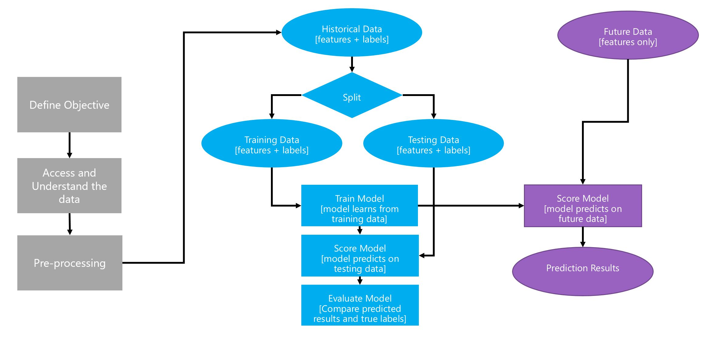
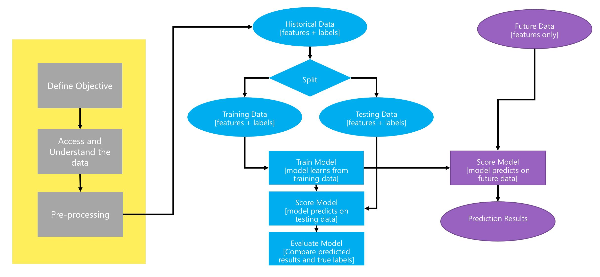
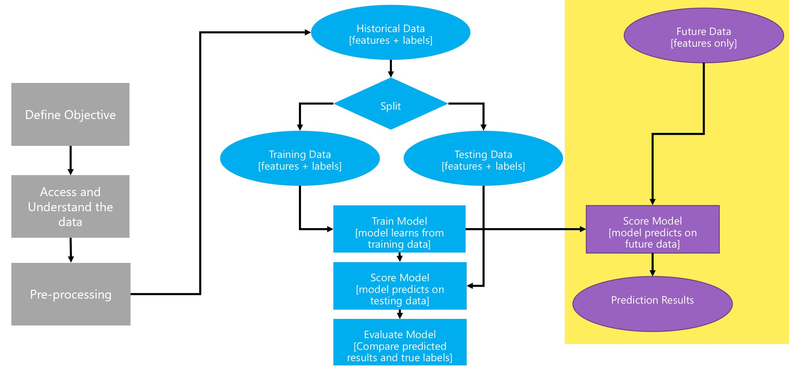
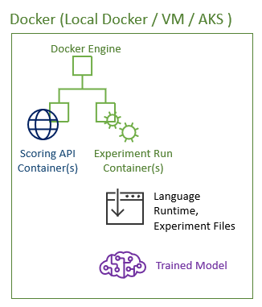

# The Team Data Science Process using Azure Machine Learning

This workshop is comprised of many hands-on labs that will guide us through using the [Team Data Science Process (TDSP)](https://docs.microsoft.com/en-us/azure/machine-learning/team-data-science-process/overview) using [Azure Machine Learning](https://docs.microsoft.com/en-us/azure/machine-learning/preview/overview-what-is-azure-ml). We will be using a [Customer Churn Analysis example](https://docs.microsoft.com/en-us/azure/machine-learning/preview/scenario-churn-prediction) throughout this workshop.

The goal of the workshop is to learn the tools that facilitate being a data scientist. We do not cover machine learning and best practices in any detail, other than introduce some basic terminology. But we strongly emphasize data science as a process and how to test and build data science solutions.

### Introduction to the TDSP

At a high level, data science as a process consists more or less of the following steps:

However in practice data science does not follow a linear workflow. Instead there is a lot of trial and error and we move forward and backward in the process of trying to build and deploy a data science solution.

Another complication arises from the fact that data science today is much more of a team effort than it was before. Devoloping and operationlizing a data science solution requires the knowledge and expertise of not just the data scientist, but also data engineers, DevOps, and the larger business. As such, we need to follow a more process-oriented workflow in order to bring a data science project to completion.

We will now simplify things a bit in order to introduce some vocabulary and concepts. A typical data science workflow for building a predictive model looks like this:

We break this up into three different stages and review each stage separately. Let's begin with the first stage.

## Part 1: Pre-modeling

In this early stage, we focus on a business understanding of the data and the problem at hand. This is a group effort involving the business, the data science team, data admins and the DevOps team along with other stakeholders. Data scientists tend to spend a lot of time on this, because failure to understand the data can lead to unexpected results further down the path. This is sometimes referred to as garbage-in-garbage-out. As such, we need to ensure that we have good data by taking steps to clean and process the data if necessary. This is sometimes referred to as data wrangling, data massaging, or pre-processing. Here is a breakdown of the steps usually involved:

### Data acquisition and understanding

- Formulating the business question as a prediction problem
- Deciding which data sources we need to answer the business question
- Run summary statistics and visualizations
- Collecting a sort of **data dictionary**
- Running various quality checks

### Data wrangling or pre-processing

- Setting up an efficient data pipeline
- Deal with missing value
- Choose how to deal with outliers (extreme values, unusual values)
- Does the data need to be aggregated

### Feature selection and feature engineering

Feature engineering is the process of going <mark>from raw data to data that is ready for modeling</mark>. It can serve multiple purposes:

- make the models easier to interpret (e.g. binning)
- capture more complex relationships (e.g. NNs)
- reduce data redundancy and dimensionality (e.g. PCA)
- rescale variables (e.g. standardizing or normalizing)

Different models may have different feature engineering requirements. Some ML packages offer built-in feature engineering for certain models.

## Part 2: Model development

### What's a model?

At a high level, a **model** is a simplification of something more complex. It is usually expressed in terms of "simple" **rules**. We say **“All models are wrong, but some are useful.”**. A machine learning algorithm <mark>uses data to automatically learn the rules</mark>. It simplifies the complexity of the data into relationships described by such rules. A predictive model is an algorithm that learns the prediction rule (equations or logical statements leading to a prediction) from *labeled* data. Once we have a predicive model, we can use it to score (obtain predictions on) historical data as well as future data. Since historical data is labeled it can be used to evaluate the accuracy of the predicive model, i.e. how close its predictions come to the true value (labels). If we are happy with the model, we can deploy it to an application and start scoring future data with it.

| term               | what is needed                              | results in           |
| ------------------ | ------------------------------------------- | -------------------- |
| training (a model) | appropriate ML algorithm + labeled data     | trained model        |
| scoring (data)     | trained model + data (labeled or unlabeled) | scores (predictions) |
| evaluating a model | scoring labeled data                        | evaluation metrics   |

Sometimes data scientists use the word model to refer to a trained model, and sometimes they use it to refer to the ML algorithm. Data science is a multi-disciplinary subject and different disciplines have different preferences in their choice of vocabulary. To those with enough experience, this ambiguity is clear from context, but the rest of us can find it confusing.

| what the machine learning community calls it | what the community of statisticians calls it       |
| -------------------------------------------- | -------------------------------------------------- |
| supervised learning algorithm (or model)     | predictive model                                   |
| trained model                                | fitted model                                       |
| supervised learning                          | prediction problem                                 |
| unsupervised learning                        | data-mining or pattern recognition                 |
| features or attributes                       | explanatory or independent variables               |
| target or labels                             | response or dependent variables                    |
| training (a model on labeled data)           | fitting (a model to labled data)                   |
| scoring (new data with a model)              | predicting (new data using a model)                |

### What's a good predictive model?

A good predictive model should meet the following criteria:

- **Accurate**: Are we making good predictions?
- **Interpretable**: How easy is it to explain how the predictions are made?
- **Fast**: How long does it take to build a model, and how long does the model take to make predictions?
- **Scalable**: How much longer do we have to wait if we build/predict using a lot more data?

This usually makes finding a good predictive model a difficult task which involves a lot of trial and error. For example, we need to choose some candidate machine learning algorithms. Each algorithm can also be *tuned* via different choices of **hyperparameters**. Different hyperparameter choices can affect the accuracy, explanability and efficiency of the resulting model. Therefore, we often run many many models before we settle on a few good models which we can take to the next stage.

## Part 3: Model deployment or operationalization

The deployment or operationalization phase entails taking our trained model and putting it in a production environment where it can be consumed (used to score future data). This can happen by creating an Application Programming Interface (API) or some other mechanism.

Once the model is served, we also go through a customer acceptance test to ensure that the model performed within acceptable time and accuracy rates, as well as address other business concerns. The customer acceptance test should address the following questions:

---

# Our use-case example

Our scenario is as follows: 

The Orange Telecom company in France is one of the largest operators of mobile and internet services in Europe and Africa and a global leader in corporate telecommunication services. They have 256 million customers worldwide. They have significant coverage in France, Spain, Belgium, Poland, Romania, Slovakia and Moldova, and a large presence Africa and the Middle East.

Customer churn is always an issue in any company. Orange would like to predict the propensity of customers to switch providers (churn), buy new products or services (appetency), or buy upgrades or add-ons proposed to them to make the sale more profitable (up-selling). In this effort, they think churn is the first thing they would like to focus on.

---

# Azure Machine Learning

We learn throughout this workshop how AML can be used to accomplish the above tasks with relative ease. Our focus is primarily on phase 2 and 3 or the data science workfolw. We will explore how AML makes it easy to create and compare many different models and how it facilitates taking models into production.

Azure Machine Learning makes it easy for data scientists to train and deploy models, in oder words to develop production-ready machine learning applications. It is comprised of a graphical user interface (GUI) called Workbench and a command line utility called the Azure CLI. Using AML, we can quickly prototype machine learning solutions on a local machine, and use Microsoft Azure to serve them on the cloud. AML supports the Python programming language and its machine learning libraries. Let's take a high-level view of the different pieces that make up the architecture:

Throughout the workshop, we should return to the above chart and think about the pieces invoked by each lab. This will help us appropriate everything that happens behind the scenes as we build our machine learning application.

We begin by installing Workbench and the Azure CLI on a local workstation or VM. This will install the desktop application, Python and its ML libraries, and the Azure CLI. We can then start a new project which will give us a folder structure containing our Python scripts, confguration files and other files.

While working on a local machine can make it easy to iterate and run experiments, dependency and compatibility issues can later cause problems in production. Therefore, we rely on [Docker](https://www.docker.com/) to build and test our machine learning applications. Docker containers offer us a clean environment where we can build our applications in isolation.

Finally, we use Microsoft Azure to serve our applications on the cloud and give us control over it. We can use manage our trained models and monitor our deployments.

All of this will be explored in much more detail in later labs throughout the workshop.
