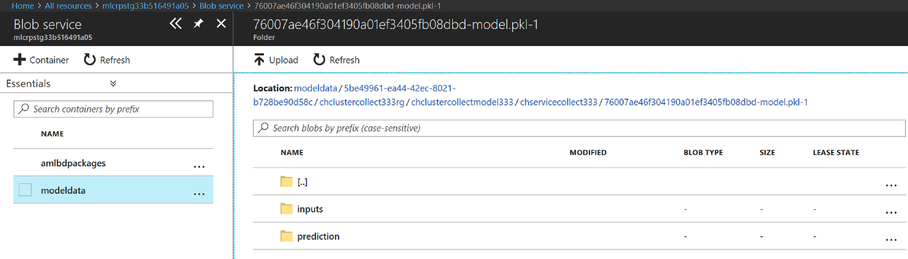

# Collect data from a scoring service

This hands-on lab guides us through collecting Machine Learning scoring data using [Azure Machine Learning](https://docs.microsoft.com/en-us/azure/machine-learning/preview/overview-what-is-azure-ml). 

In this lab, we will

- Use the `azureml.datacollector` module to collect data from scoring calls
- Use Azure Storage to view the results

***NOTE:*** There are several pre-requisites for this course, including an understanding and implementation of

- Machine Learning and Data Science
- Intermediate to Advancced Python programming
- Microsoft Azure Storage concepts
- Working with the Azure Portal

There is a comprehensive Learning Path we can use to prepare for this course [located here](https://github.com/Azure/learnAnalytics-CreatingSolutionswiththeTeamDataScienceProcess-/blob/master/Instructions/Learning%20Path%20-%20Creating%20Solutions%20with%20the%20Team%20Data%20Science%20Process.md).

We will review these articles in class: 

  1.  [Model data collection](https://docs.microsoft.com/en-us/azure/machine-learning/preview/how-to-use-model-data-collection)
  2.  [Azure Machine Learning Model Data Collection API reference](https://docs.microsoft.com/en-us/azure/machine-learning/preview/model-data-collection-api-reference)

The process and flow for using Azure Machine Learning Services has this layout:  


## Section 1: Collecting Model Data

In this section, we demonstrate the model data collection feature in AML to archive model inputs and predictions from a web service.

### Step 1.1: Update the code to collect data with the appropriate libraries

Open the Churn Prediction project we created from the previous labs. 

To use model data collection, add the following code at the top of the scoring file `score.py`:

```
from azureml.datacollector import ModelDataCollector
```

Add the following lines of code to the `init()` function (making sure that you preserve indentation):

```
global inputs_dc, prediction_dc
inputs_dc = ModelDataCollector('model.pkl',identifier="inputs")
prediction_dc = ModelDataCollector('model.pkl', identifier="prediction")
```

Add the following lines of code to the `run(input_df)` function:

```
global inputs_dc, prediction_dc
inputs_dc.collect(input_df)
prediction_dc.collect(pred)
```

Make sure that the variables `input_df` and `pred` (prediction value from `model.predict()`) are initialized before we call the `collect()` function on them.

The final `score.py` would appear as follows:

```python
# This script generates the scoring and schema files
# necessary to operationalize the model
from azureml.api.schema.dataTypes import DataTypes
from azureml.api.schema.sampleDefinition import SampleDefinition
from azureml.api.realtime.services import generate_schema
from azureml.datacollector import ModelDataCollector
import pandas
import os

# Prepare the web service definition by authoring
# init() and run() functions. Test the functions
# before deploying the web service.
def init():
    from sklearn.externals import joblib

    # load the model file
    global model
    model = joblib.load('model.pkl')

    global inputs_dc, prediction_dc
    inputs_dc = ModelDataCollector('model.pkl',identifier="inputs")
    prediction_dc = ModelDataCollector('model.pkl', identifier="prediction")

def run(input_df):
    import json
    input_df_encoded = input_df    
    input_df_encoded = input_df_encoded.drop('year', 1)
    input_df_encoded = input_df_encoded.drop('month', 1)
    input_df_encoded = input_df_encoded.drop('churn', 1)

    columns_encoded = ['age', 'annualincome',    
       'calldroprate', 'callfailurerate', 'callingnum',
       'customerid', 'monthlybilledamount', 'numberofcomplaints',
       'numberofmonthunpaid', 'numdayscontractequipmentplanexpiring',
       'penaltytoswitch', 'totalminsusedinlastmonth', 'unpaidbalance',
       'percentagecalloutsidenetwork', 'totalcallduration', 'avgcallduration',
       'churn', 'customersuspended_No', 'customersuspended_Yes',
       'education_Bachelor or equivalent', 'education_High School or below',
       'education_Master or equivalent', 'education_PhD or equivalent',
       'gender_Female', 'gender_Male', 'homeowner_No', 'homeowner_Yes',
       'maritalstatus_Married', 'maritalstatus_Single', 'noadditionallines_\\N',
       'occupation_Non-technology Related Job', 'occupation_Others',
       'occupation_Technology Related Job', 'state_AK', 'state_AL', 'state_AR',
       'state_AZ', 'state_CA', 'state_CO', 'state_CT', 'state_DE', 'state_FL',
       'state_GA', 'state_HI', 'state_IA', 'state_ID', 'state_IL', 'state_IN',
       'state_KS', 'state_KY', 'state_LA', 'state_MA', 'state_MD', 'state_ME',
       'state_MI', 'state_MN', 'state_MO', 'state_MS', 'state_MT', 'state_NC',
       'state_ND', 'state_NE', 'state_NH', 'state_NJ', 'state_NM', 'state_NV',
       'state_NY', 'state_OH', 'state_OK', 'state_OR', 'state_PA', 'state_RI',
       'state_SC', 'state_SD', 'state_TN', 'state_TX', 'state_UT', 'state_VA',
       'state_VT', 'state_WA', 'state_WI', 'state_WV', 'state_WY',
       'usesinternetservice_No', 'usesinternetservice_Yes',
       'usesvoiceservice_No', 'usesvoiceservice_Yes']
    
    for column_encoded in columns_encoded:
        if not column_encoded in input_df.columns:
            input_df_encoded[column_encoded] = 0

    columns_to_encode = ['customersuspended', 'education', 'gender', 'homeowner', 'maritalstatus', 'noadditionallines', 'occupation', 'state', 'usesinternetservice', 'usesvoiceservice']
    for column_to_encode in columns_to_encode:
        dummies = pandas.get_dummies(input_df[column_to_encode])
        one_hot_col_names = []
        for col_name in list(dummies.columns):
            one_hot_col_names.append(column_to_encode + '_' + col_name)
            input_df_encoded[column_to_encode + '_' + col_name] = 1
        input_df_encoded = input_df_encoded.drop(column_to_encode, 1)
    
    pred = model.predict(input_df_encoded)

    inputs_dc.collect(input_df)
    prediction_dc.collect(pred)
    return json.dumps(str(pred[0]))
```

### Step 1.2: Update environment variables

Before we create a local service using `az ml service create`, we must set two environment variables to enable data collection: `AML_MODEL_DC_STORAGE_ENABLED` and `AML_MODEL_DC_STORAGE`. `AML_MODEL_DC_STORAGE_ENABLED` must be set to `true`, and `AML_MODEL_DC_STORAGE` must be set to the connection string for the storage account you would like to use. One good option for the storage account is the storage account associated with your local compute env. When using an Azure Container Service cluster as a compute environment, the storage account associated with the env is the storage account used for data collection by default.

To see the name of the storage account used by your compute environment, you can type:

```
az ml env show -v
```

The commands to set these environment variables would look something like:

```
set AML_MODEL_DC_STORAGE_ENABLED=true
set AML_MODEL_DC_STORAGE=DefaultEndpointsProtocol=https;AccountName=myamldc;AccountKey=REALLYLONGKEYWITHLOTSOFCHARACTERS$%&#^@!(($@&@!!^^^;EndpointSuffix=core.windows.net
```

### Step 1.3: Create the service with appropriate flags

Once these environment variables are set, we can now use the `az ml service create realtime` command with the `--collect-model-data true` switch to create a real-time web service. This step makes sure that the model data is collected when the service is called.

```
az ml service create realtime -f score.py --model-file model.pkl -s service_schema.json -n churnapp -r python --collect-model-data true
```

### Step 1.4: Run the service to collect data

To test the data collection, run the `az ml service run realtime` command:

```
az ml service run realtime -i <SERVICE_ID> -d "ADD INPUT DATA HERE!!"
```

### Section 2: View Collected Data

To view the collected data in blob storage:

Sign in to the [Azure portal](https://portal.azure.com/) and select **More Services**. In the search box, type **Storage accounts** and hit Enter. From the Storage accounts search blade, select the **Storage account** resource. Navigate to the storage account identified environment variable you set above. Within that storage account, you should see a container called `modeldata`.

Select the container called `modeldata`. To see data start propagating to the storage account, we need to wait up to 10 minutes after the first web service request. Data flows into blobs with the following container path:

```
/modeldata/<SUBSCRIPTION_ID>/<RESOURCE_GROUP>/<MODEL_MANAGEMENT_ACCOUNT>/<WEBSERVICE>/<MODEL_ID>-<MODEL>-<MODEL_VERSION>/<IDENTIFIER>/<YEAR>/<MONTH>/<DAY>/data.csv
```

The inputs and prediction folders in the container would be created as follows:



Data can be consumed from Azure blobs in multiple ways. Some examples are

- **Workbench**: Open the .csv file in Workbench by adding the .csv file as a data source.
- **Excel**: Open the daily .csv files as a spreadsheet.
- **Power BI**: Create charts with data pulled from .csv data in blobs.
- **Spark**: Create a data frame with a large portion of .csv data.
- **Hive**: Load .csv data into a Hive table and perform SQL queries directly against the blob.

## Lab Completion

In this lab we learned how to:

- Use the `azureml.datacollector` module to collect data from scoring calls
- Use Azure Storage to view the results
